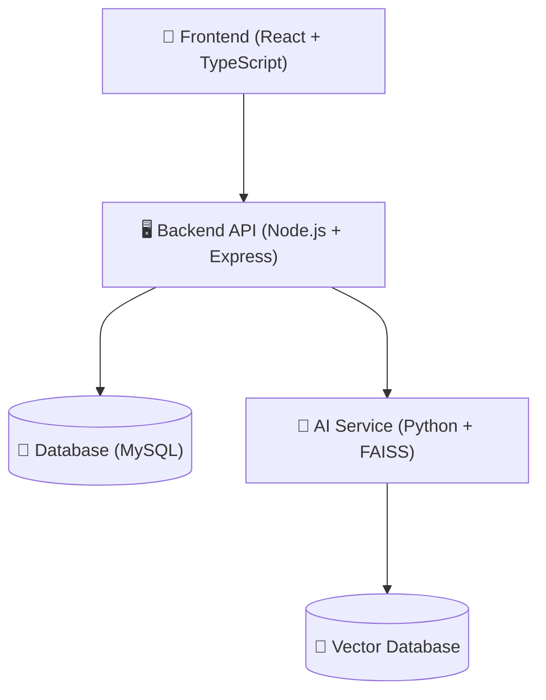

<div align="center">

# 🏛️ LawTech

### Интеллектуальная юридическая платформа

[](https://reactjs.org/)
[](https://www.typescriptlang.org/)
[](https://nodejs.org/)
[](https://expressjs.com/)
[](https://www.python.org/)
[](https://www.mysql.com/)

</div>

## 📋 Описание

LawTech — это современная платформа для работы с юридическими документами, использующая искусственный интеллект и векторный поиск для анализа, классификации и поиска информации в юридических текстах. Платформа помогает юристам и правовым специалистам эффективно работать с большими объемами правовой информации.

### ✨ Ключевые возможности

- 🤖 **ИИ-ассистент** — интеллектуальный помощник для ответов на юридические вопросы
- 🔍 **Векторный поиск** — семантический поиск по базе юридических документов
- 📄 **Управление документами** — загрузка, классификация и хранение юридических документов
- 👥 **Многопользовательский режим** — работа в команде с разграничением прав доступа
- 📊 **Аналитика** — статистика и отчеты по работе с документами

## 🏗️ Архитектура

<div align="center">



</div>

- **Frontend**: React + TypeScript + Vite + Ant Design
- **Backend**: Node.js + Express
- **AI Service**: Python + FAISS для векторного поиска
- **База данных**: MySQL

## 🚀 Быстрый старт

### Требования

- Node.js 18+
- Python 3.8+
- MySQL 8.0+

### Установка

1. **Клонирование репозитория**

```bash
git clone https://github.com/Br1Im/LawTech.git
cd LawTech
```

2. **Установка зависимостей для backend**

```bash
cd server
npm install
```

3. **Установка зависимостей для frontend**

```bash
cd ../frontend
npm install
```

4. **Установка Python зависимостей**

```bash
cd ../server/scripts
pip install -r requirements.txt
```

### Запуск

1. **Запуск FAISS сервиса**

```bash
# В директории server/scripts
python faiss_service.py
```

2. **Запуск backend**

```bash
# В директории server
npm run dev
```

3. **Запуск frontend**

```bash
# В директории frontend
npm run dev
```

## 📁 Структура проекта

```
├── frontend/          # React приложение
│   ├── src/           # Исходный код
│   │   ├── app/       # Конфигурация приложения
│   │   ├── components/# Компоненты UI
│   │   ├── context/   # React контексты
│   │   ├── entities/  # Бизнес-сущности
│   │   ├── features/  # Функциональные модули
│   │   ├── pages/     # Страницы приложения
│   │   ├── shared/    # Общие утилиты и типы
│   │   └── widgets/   # Составные компоненты
│   ├── public/        # Статические файлы
│   └── package.json   # Зависимости и скрипты
│
└── server/            # Node.js API
    ├── controllers/   # Контроллеры API
    ├── models/        # Модели данных
    ├── middleware/    # Промежуточные обработчики
    ├── routes/        # Маршруты API
    ├── services/      # Бизнес-логика
    ├── scripts/       # Python сервисы
    ├── utils/         # Утилиты
    └── package.json   # Зависимости и скрипты
```

## 🔌 API Endpoints

| Метод | Endpoint | Описание |
|-------|----------|----------|
| GET | `/api/health` | Проверка работоспособности |
| POST | `/api/auth/login` | Авторизация пользователя |
| POST | `/api/auth/register` | Регистрация пользователя |
| GET | `/api/user/profile` | Получение профиля пользователя |
| POST | `/api/chat` | Взаимодействие с ИИ-ассистентом |
| POST | `/api/upload` | Загрузка документов |
| GET | `/api/legal-documents` | Получение списка документов |
| GET | `/api/legal-documents/:id` | Получение документа по ID |

## ⚙️ Переменные окружения

### Backend (.env)

```
NODE_ENV=development
PORT=3001
JWT_SECRET=your_jwt_secret
FAISS_SERVICE_URL=http://localhost:5000
DB_HOST=localhost
DB_USER=root
DB_PASSWORD=password
DB_NAME=lawtech
```

### FAISS Service (.env)

```
PYTHONUNBUFFERED=1
PORT=5000
```

## 👨‍💻 Разработка

### Команды для разработки

**Backend:**

```bash
# Запуск в режиме разработки
npm run dev

# Запуск FAISS сервиса
npm run start:faiss
```

**Frontend:**

```bash
# Запуск в режиме разработки
npm run dev

# Сборка для продакшена
npm run build

# Предпросмотр сборки
npm run preview

# Проверка кода линтером
npm run lint
```

## 📄 Лицензия

MIT License

---

<div align="center">

**LawTech** — Разработано с ❤️ для юридического сообщества

</div>